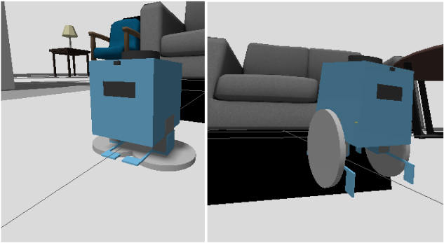
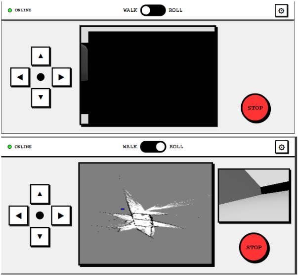

# OTTO-ROS2 Robotic - Simulation

## Overview
OTTO-ROS2 is an advanced robotics project inspired by the *OTTO DIY* robot, engineered to support bimodal locomotion. **Walking Mode** (via joint trajectory gaits) and **Rolling Mode** (via differential drive). 
This repository contains a complete *ROS2* simulation package, including the *physics models*(URDF) of the robot, the *Python* script used organize the system, the *mapping* (SLAM), an autonomous navigation (Nav2), and a custom *Neo-Brutalist Web control*.



## Key Features
* **Bimodal Locomotion:** The robot dynamically switches between a `joint_trajectory_controller` for walking and a `diff_drive_controller` for rolling, managed safely by a custom Python state machine.
* **Mapping:** Uses `slam_toolbox` to actively map unknown environments and localize the robot in real-time.
* **Autonomous Navigation:** Fully integrated with the Nav2 stack for path planning and obstacle avoidance.
* **Web Control:** HTML/JS based interface that connects to ROS2 via `rosbridge_suite`. Features a Picture-in-Picture (PiP) tactical display routing both MJPEG camera streams and live interactive maps.
* **Hardware E-Stop:** A custom 20Hz active software lock utilizing `twist_mux` priorities to instantly sever Nav2's control of the wheels during emergencies.

## System Architecture
### Frontend (Web Interface)
* **HTML/CSS/JS:** Vanilla web stack with a high-contrast tactical aesthetic.
* **roslibjs:** Handles websocket communication (Topics, Services, Actions) with the ROS 2 backend.
* **ros2djs & EaselJS:** Renders the SLAM occupancy grid and handles affine transformations for panning, zooming, and coordinate mapping.

### Backend (ROS2)
* **rosbridge_server:** Bridges the ROS2 network to the web browser via WebSockets.
* **otto_teleop.py:** The central locomotion engine. Handles web commands, manages the 20Hz E-Stop lock, and sequences walking trajectories.
* **twist_mux:** The hardware gatekeeper that prioritizes manual teleop commands over autonomous Nav2 commands.
* **slam_toolbox & Nav2:** Manages the `.posegraph` lifelong mapping and global/local path planning.

## Installation & Prerequisites
This project is built on **ROS 2 Jazzy**  and requires the following standard packages to be installed on the robot/host machine.

```bash
sudo apt update
sudo apt install ros-jazzy-rosbridge-server \
                 ros-jazzy-web-video-server \
                 ros-jazzy-slam-toolbox \
                 ros-jazzy-navigation2 \
                 ros-jazzy-nav2-bringup \
                 ros-jazzy-nav2-map-server \
                 ros-jazzy-twist-mux \
                 ros-jazzy-ros2-control \
                 ros-jazzy-ros2-controllers \
                 ros-jazzy-teleop-twist-keyboard
```

## Clone and Build the Workspace
```bash
mkdir -p ~/otto_ws/src
cd ~/otto_ws/src
git clone <your-repository-url> OTTO-ROS2
cd ~/otto_ws
colcon build --packages-select otto_description --symlink-install
source install/setup.bash
```

## Launch Instructions
To bring the entire system online, you will need to open multiple terminals. Remember to run `source install/setup.bash` in each new terminal.

**Terminal 1:**Start the physics simulation
Launches Gazebo, spawns the URDF and starts the *ros2_control* managers.
``ros2 launch otto_description simulation.launch.py``


**Terminal 2:** Start the web bridge
Opens the WebSocket server (*rosbridge*) on port 9091 adn starts the *web_video_server*.
``ros2 launch otto_description web_control.launch.py``

**Terminal 3:** Launch the map and the autonomous logic
Launches SLAM/AMCL,  Nav2 and *twist_mux*
``ros2 launch otto_description nav_amcl.launch.py``   # launches an existing map
``ros2 launch otto_description nav_slam.launch.py``   # Launches from a scratch map

**Terminal 4:** Host the user interface
Open a new terminal on your local machine if you used *wsl* in the whole time.
Navigate to: `cd \\wsl.localhost\Ubuntu\home\{user_name}\otto_ws\src\OTTO-ROS2\web"`
Then run the web server: ``python3 -m http.server 8000``

Open your browser and navigate to *http://{IP_ADRESS}:8000*

## Interface Guide
* **Walk Mode (Default)**: The robot acts as a biped. The central screen displays the live Gazebo camera feed. Use the D-Pad to trigger walking gaits.
* **Roll Mode**: Toggle the master switch to engage the diff_drive_controller. The interface dynamically shifts to a Picture-in-Picture mode: the SLAM generated map fills the main screen, while the camera moves to a secondary monitor.
* **Autonomous Navigation**: While in Roll Mode, tap anywhere on the map grid. The system will drop a waypoint, release the hardware lock, and Nav2 will autonomously drive the robot to the destination.  
* **E-Stop**: Hitting the red STOP button engages an active 20Hz velocity lock in *twist_mux*. It will instantly halt manual walking, rolling, or active Nav2 autonomous missions. Tap the map again to release the lock. 


## Future Hardware Implementation
I have built a fully functionnal bimodal robot in **simulation**. The next challenge will be the building of the a real **Physical hardware**.